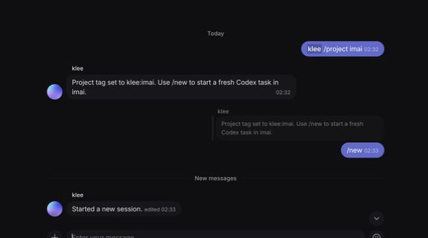
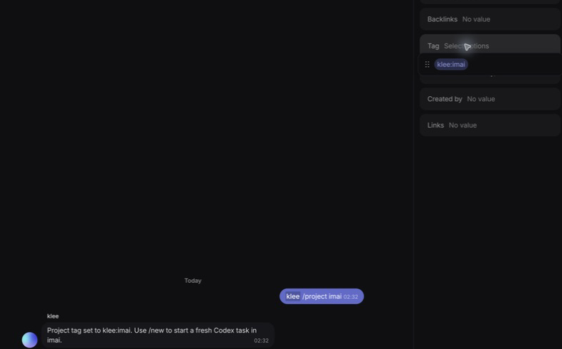

# Workflow recipes

This guide shows how to configure common Knot workflows that are available in the current release.
Here, a workflow means a supported conversation pattern built from routes, wake rules, runtime
sessions, and scoped tools.

Knot has the Phase 2 durable runner core, but it does not yet include agent, Anytype, HTTP, or
notification effect executors. Do not create `Knot Workflow` objects expecting those steps to
perform work. The shipped queue can exercise an empty transform step for recovery testing. Its
contracts and remaining implementation work are in
[`workflow-runtime-contract.md`](workflow-runtime-contract.md) and
[`planned-work.md`](planned-work.md).

Definitions may contain prompts and approval messages, but Knot stores only their digests. The
current gateway has no source resolver. Such a run stops in `source_refetch_required` before any
executor receives definition text.

## Before you start

Complete the [agent setup runbook](agent-setup.md) first. Each recipe assumes that:

- Knot has a dedicated Anytype member and API key;
- the member has joined the required spaces;
- `knot validate` and `knot doctor` pass;
- one foreground `knot run` process owns the configuration and state database;
- every placeholder ID and path below is replaced with an exact local value.

The YAML blocks in this guide are fragments. Merge only the relevant block into the agent's full
configuration. Keep the complete configuration outside the repository.

Use stable Anytype participant or identity IDs in every allowlist. A display name is never proof of
identity and must not grant access.

## Choose a recipe

| Goal                                               | Recipe                                                              |
| -------------------------------------------------- | ------------------------------------------------------------------- |
| Wake only when mentioned                           | [Mention-only chat](#mention-only-chat)                             |
| Continue through replies without another mention   | [Mention and reply chat](#mention-and-reply-chat)                   |
| React to every message from approved people        | [Always-listening chat](#always-listening-chat)                     |
| Add the agent safely to chats created later        | [Trusted chat discovery](#trusted-chat-discovery)                   |
| Talk to the agent one-to-one                       | [Direct messages](#direct-messages)                                 |
| Use an agent inside object comments                | [Object discussions](#object-discussions)                           |
| Start Codex sessions in a selected project         | [Codex project selection](#codex-project-selection)                 |
| Select a model for one conversation                | [Per-conversation models](#per-conversation-models)                 |
| Create another Codex task or linked Anytype chat   | [Codex task creation](#codex-task-creation)                         |
| Let the agent read or change Anytype objects       | [Anytype object work](#anytype-object-work)                         |
| Deliver scheduled OpenClaw output to the same chat | [OpenClaw scheduled continuation](#openclaw-scheduled-continuation) |
| Let trusted people change route behavior           | [Route self-management](#route-self-management)                     |
| Let two agents coordinate in one chat              | [Agent coordination](#agent-coordination)                           |

## Mention-only chat

Use this for an agent that should remain silent until an approved person mentions it.

```yaml
spaces:
  - id: _space_id
    chats:
      - id: _chat_id
        wake:
          humans: mention
          agents: never
          allowedUsers:
            - _participant_owner_id
    comments:
      mode: disabled
```

Expected behavior:

- A native mention from the allowed person starts or resumes the chat's runtime session.
- An unmentioned message stays silent.
- A mention from anyone outside `allowedUsers` stays silent.
- A reply without a new mention stays silent.

Verify it by sending one ordinary message, one native mention from the allowed account, and one
native mention from a different account. Only the allowed mention should produce the working
reaction and response.

## Mention and reply chat

Use this for ordinary agent conversations. The first turn requires a mention, but a reply to a Knot
response can continue or steer the same session.

```yaml
spaces:
  - id: _space_id
    chats:
      - id: _chat_id
        wake:
          humans: mention-or-reply
          agents: never
          allowedUsers:
            - _participant_owner_id
    comments:
      mode: disabled
```

Start with a native mention. While the agent is working, reply in the same chat. Knot should freeze
the previous progress reply, create a new response under the follow-up, and steer the active runtime
instead of starting unrelated work.

Send `/new` in an authorized wake message when you want a fresh runtime session for the same
Anytype chat. An active run is replaced instead of steered.

## Always-listening chat

Use this only in a chat where every approved human message should wake the agent.

```yaml
spaces:
  - id: _space_id
    chats:
      - id: _chat_id
        wake:
          humans: every-message
          agents: never
          allowedUsers:
            - _participant_owner_id
            - _participant_collaborator_id
    comments:
      mode: disabled
```

The route still checks the sender before waking. Do not replace the allowlist with `"*"` in a
shared workspace unless every member should be able to run the agent and its tools.

Verify the route with messages from an allowed and a disallowed account. Only allowed senders
should receive the working reaction.

## Prefix-triggered chat

Use a prefix when native mentions are inconvenient but the chat should not wake on every message.

```yaml
wake:
  humans: prefix
  prefix: "klee:"
  agents: never
  allowedUsers:
    - _participant_owner_id
```

`klee: review this` wakes the agent. A message with the prefix in the middle does not. Prefix mode
still requires an allowed native sender identity.

## Trusted chat discovery

Use discovery when the agent has joined a space and should notice current and future chats. Add
`autoEnroll: true` when a trusted person's first direct mention should persist that chat as an
explicit route.

```yaml
spaces:
  - id: _space_id
    chatDiscovery:
      enabled: true
      autoEnroll: true
      discoveryIntervalSeconds: 30
      wake:
        humans: mention-or-reply
        agents: never
        allowedUsers:
          - _participant_owner_id
    chats: []
    comments:
      mode: disabled
```

Auto-enrollment requires a mention-based human policy and an explicit allowlist. Knot rejects
`every-message` and wildcard enrollment policies. A space membership alone never authorizes every
chat.

Create a test chat after Knot starts, add the agent member, and mention it from the allowed account.
The chat should be added to the YAML configuration and continue working after a service restart.

## Direct messages

Enable direct messages when selected Anytype identities should talk to the agent without mentioning
it. DM wake behavior is always `every-message`.

```yaml
directMessages:
  enabled: true
  createMissing: false
  discoveryIntervalSeconds: 30
  wake:
    humans: every-message
    agents: never
    allowedUsers:
      - _stable_owner_identity_id
```

Knot discovers `anytype.onetoone` spaces and verifies that the configured agent and allowed peer are
active members. It never treats a shared space as a DM. Wildcards and mention-only DM policies are
rejected.

Set `createMissing: true` only when the local Heart adapter should initialize an absent authorized
pairwise DM. This creates workspace state and sends the Anytype one-to-one invitation.

Verify the workflow in a real one-to-one conversation. The allowed peer's plain message should wake
the agent. A DM from any identity outside the allowlist should remain silent.

## Object discussions

Object discussions require the optional Heart adapter because the public Anytype API does not
currently expose the mapping from an object to its internal discussion ID.

```yaml
anytype:
  heartAdapter:
    command: knot-heart-adapter
    grpcAddress: 127.0.0.1:31010

spaces:
  - id: _space_id
    chats: []
    comments:
      mode: all
      createMissing: false
      discoveryIntervalSeconds: 60
      wake:
        humans: mention-or-reply
        agents: never
        allowedUsers:
          - _participant_owner_id
```

Use `mode: filtered` with `includeObjectTypes` when only selected Anytype object types should be
watched:

```yaml
comments:
  mode: filtered
  includeObjectTypes:
    - _task_type_id
    - _note_type_id
  excludeObjectTypes: []
  createMissing: false
  wake:
    humans: mention-or-reply
    agents: never
    allowedUsers:
      - _participant_owner_id
```

`createMissing: true` adds discussions to matching objects that do not have one, so leave it off
unless you intend that workspace mutation.

Mention the agent in a test object's discussion. Knot should react to the exact comment and reply in
that same discussion thread. The prompt should include the owning object and the current root comment
thread. Test a follow-up reply as well as a new top-level comment.

## Codex project selection

Declare every project the agent may use. The list communicates intent to Codex but does not replace
Codex permissions or an operating-system sandbox.

```yaml
runtime:
  kind: codex
  command: codex-acp
  desktopProject: auto
  defaultProject: /Users/example/projects/agent-workspace
  allowedProjects:
    - /Users/example/projects/imai

management:
  allowProjectChanges: true
  projectAdmins:
    - _stable_owner_identity_id
```

Use these commands in the Anytype chat:

```text
/projects
/project imai
/new
```

`/project imai` writes the Chat tag `agent-name:imai`, such as `klee:imai`. The next `/new` starts a
fresh Codex session in the configured project whose final directory name is `imai`. `/project
default` removes only that agent's project tag.

Knot revalidates the tag on every `/new`. An unknown, empty, or ambiguous project blocks the reset
instead of falling back to another workspace. A Chat may contain separate tags for several agents;
each agent reads only its own prefix.

### Visual walkthrough

Use `/projects` to see valid choices, then run `/project imai` in an authorized wake message. This
example mentions Klee for the first command and sends `/new` as a reply, which satisfies the
`mention-or-reply` wake rule.



For an agent named Klee, Knot writes `klee:imai` to the Chat's existing **Tag** property. Open the
Chat information panel, select **Tag**, and expand the selector to verify the stored value:



The agent-name prefix lets one Chat carry independent bindings for several agents. Do not edit the
tag by hand unless you are repairing state: the `/project` command validates the project and writes
the canonical value. After `/new`, send an ordinary authorized turn and confirm that its task appears
under the `imai` project in Codex.

## Per-conversation models

Knot reads the live model catalog from Codex or OpenClaw. Enable the feature and restrict the
catalog when needed.

```yaml
models:
  enabled: true
  allowed:
    - "*"

management:
  allowModelChanges: true
  modelAdmins:
    - _stable_owner_identity_id
```

Use these commands in Anytype:

```text
/models
/model
/model <model-id-or-number>
/model default
/new --model <model-id>
```

The selection belongs to one chat or root discussion thread. A plain model change applies after an
active run. `/new --model` replaces an active run and starts a fresh session with the selected model.

In shared deployments, replace `"*"` with exact model IDs or provider/model patterns. Confirm the
selected model with `/model`, then send a normal turn in the same conversation.

## Codex task creation

Enable the Codex management tools when the current agent should create a separate Codex task in an
already allowed project.

```yaml
tools:
  codex:
    enabled: true
    command: codex
    sandbox: workspace-write
```

An agent can then call `aag_create_codex_task` when you explicitly ask for a separate task. Ordinary
conversation work stays in the current session.

To let the agent create a new Anytype chat and bind it one-to-one to a new Codex task, also enable
scoped Anytype writes:

```yaml
tools:
  anytype:
    enabled: true
    allowWrite: true
    allowArchive: false
    allowedSpaceIds:
      - _space_id
    allowedFileRoots:
      - /Users/example/projects
  codex:
    enabled: true
    command: codex
    sandbox: workspace-write
```

Ask the agent to create a linked chat with a name, project, and initial task. It must use
`aag_create_bound_chat` and report success only when the tool returns `status: bound`. If either
resource cannot be linked, Knot reports the resources that need operator attention instead of
claiming a complete binding.

## Anytype object work

Enable the MCP server and grant only the spaces and file roots the agent needs.

```yaml
tools:
  anytype:
    enabled: true
    allowWrite: true
    allowArchive: false
    allowedSpaceIds:
      - _space_id
    allowedFileRoots:
      - /Users/example/projects/agent-workspace
```

Codex ACP receives the Knot MCP server automatically. Add this server to OpenClaw's native MCP
configuration:

```json5
{
  mcp: {
    servers: {
      knot_anytype: {
        command: "knot",
        args: ["mcp", "--config", "/absolute/path/to/agent.yaml"],
      },
    },
  },
}
```

A safe object workflow follows this order:

1. Call `aag_context` to read the current route and permissions.
2. Discover types, properties, select tags, templates, collections, and views.
3. Read an existing object before changing it.
4. Create or update the object while preserving unrelated properties.
5. Add or remove collection membership only when requested.
6. Return `object_ref` for a compact link or `object_card` for a native Anytype card.

Archive remains disabled until `allowArchive: true` is set. Uploads must resolve inside an allowed
file root, must be regular files, and are capped at 50 MiB. The profile-image tool can update only
the authenticated agent's own Anytype identity.

Test in a non-production space: find a type, create a temporary object, update it, find it again,
send its native object card, and confirm that a write to an unlisted space fails.

## OpenClaw scheduled continuation

OpenClaw owns schedules. Knot only preserves the conversation session and Anytype delivery target.
Do not create a second schedule in Knot.

Prerequisites:

- the OpenClaw Gateway and native Anytype channel are configured;
- the current Anytype chat or discussion has already established an OpenClaw session;
- `knot mcp` is available to OpenClaw;
- the bundled channel bridge uses the same private token on loopback.

Ask the agent to call `aag_context` for the current route. For object discussions it must also pass
the current `discussion_root_id`. The result contains a `continuation_argv` value.

Create a native OpenClaw command job from that exact argument list and replace only
`<scheduled prompt>`. Do not use a plain cron `agentTurn`; OpenClaw isolates it under another session
key and it will not continue the Anytype conversation.

Run a short one-time test. Only the scheduled assistant output should appear in the bound Anytype
conversation. Remove the test schedule afterward. Call `aag_context` again after `/new` because the
native session key changes.

Codex ACP does not expose the Codex Desktop scheduler. Knot does not emulate one, so this recipe is
OpenClaw-only in the current release.

## Route self-management

Enable only the management actions that trusted Anytype senders need.

```yaml
management:
  allowWakeChanges: true
  allowAccessChanges: true
  allowModelChanges: false
  allowProjectChanges: false
  accessAdmins:
    - _stable_owner_identity_id
  modelAdmins: []
  projectAdmins: []
```

With the Knot MCP server available, an authorized person can tell the agent to listen to every
message, return to mention-only behavior, or disable the current route. The runtime must call
`aag_set_wake` and must not claim success unless the tool succeeds.

Access changes are separate. Only an identity in `accessAdmins` may ask the agent to add, remove, or
replace sender IDs through `aag_set_access`. The tool rejects wildcard grants and prevents an admin
from removing an access admin.

Authorization is based on the native Anytype sender, never a display name or an ID supplied by the
model. Codex binds the sender directly to its turn. For OpenClaw, Knot supplies an opaque,
single-use capability scoped to that sender, route, and management action; the next human turn
invalidates any unused capability. Do not add a static actor ID to OpenClaw's MCP configuration.

The change is scoped to the current chat or discussion and applies to the next message without a
restart. Direct-message policy stays in operator configuration and cannot be changed through route
self-management.

## Agent coordination

Register each peer by its immutable Anytype participant ID. Configure the same relationship on each
machine that should recognize the other agent.

```yaml
coordination:
  peers:
    - name: Anya
      participantId: _participant_anya_id
      aliases: [anya]
  maxHops: 3
  maxFanout: 4
  maxActivationsPerThread: 12
  windowSeconds: 300

spaces:
  - id: _space_id
    chats:
      - id: _chat_id
        wake:
          humans: mention-or-reply
          agents: direct-mention
          allowedUsers:
            - _participant_owner_id
            - _participant_anya_id
    comments:
      mode: disabled
```

To tag the peer, the runtime writes `[[AAG_MENTION:Anya]]`. Knot converts a configured peer marker to
a native Anytype mention. Unknown markers remain text. Fan-out, hop, and activation limits prevent
unbounded agent loops.

Verify coordination with a harmless request in a test chat. Confirm that the first agent emits a
native mention, the peer wakes once, and ordinary unmentioned peer output does not wake the first
agent when `agents: direct-mention` is active.

## Response behavior shared by every recipe

```yaml
responses:
  mode: milestones
  streaming: true
  thinking: stream
  editIntervalMilliseconds: 900
  workingText: Working…
  workingReaction: 👀
  silentPlaceholder: delete
```

- `single` shows the answer without tool milestones.
- `milestones` shows concise tool lifecycle updates while work is active.
- `verbose` also includes runtime status output.
- `thinking: stream` shows safe progress text from the runtime, not hidden chain-of-thought.
- A runtime may return `[[AAG_STAY_SILENT]]` when it intentionally has nothing to post.

The working reaction belongs to the triggering Anytype message. The first reply is edited as work
progresses. The following answer replaces the activity feed in that same message, and later answer
parts receive separate streamed messages.

## Verify any recipe

After changing the configuration:

```bash
knot validate --config ~/.config/knot/agent.yaml
knot doctor --config ~/.config/knot/agent.yaml
knot service restart
knot service status
knot service logs
```

For a new deployment, run `knot run` in the foreground before installing the service. Exercise the
allowed path and at least one denied path. Confirm the native Anytype sender ID in logs or diagnostic
state rather than relying on the visible name.

Use the [live regression runbook](live-regression.md) before releasing routing or runtime changes.
It covers session continuity, steering, projects, models, discussions, object operations, media,
direct messages, agent coordination, and access control with real Anytype identities.
